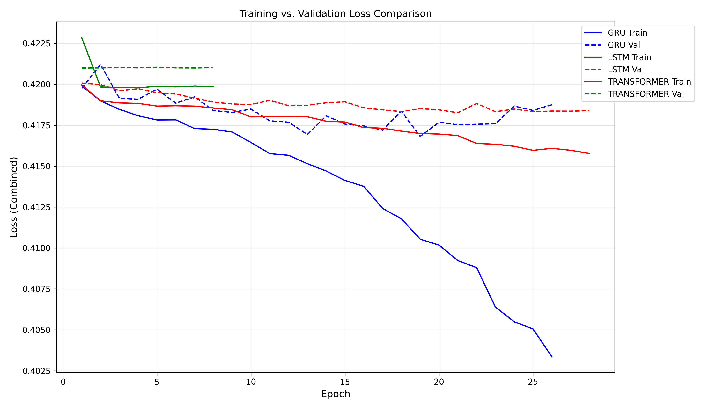
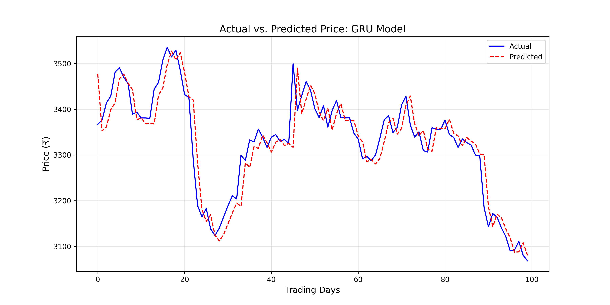
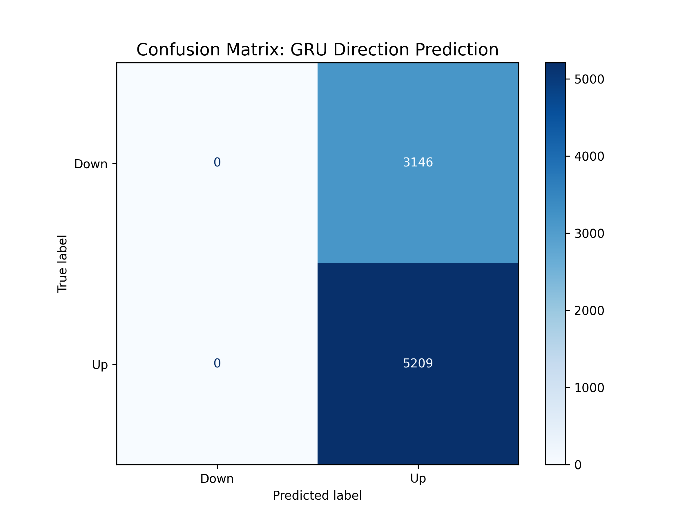

# Nifty 50 Multi-Task Stock Forecasting Engine

A sophisticated Deep Learning suite designed to predict the Indian Stock Market (Nifty 50) using a **Multi-Task Learning (MTL)** approach. The system simultaneously predicts **next-day percentage returns** (regression) and **price direction** (classification).

## Key Highlights
- **Multi-Task Architecture:** Uses a shared backbone with dual "heads" to solve two problems at once.
- **Architectures Compared:** Benchmarks **LSTM**, **GRU**, and **Transformer** models.
- **Bias Correction:** Implements **Weighted Binary Crossentropy** to handle market "Up-bias," significantly improving "Down" signal detection.
- **Live Dashboard:** Includes a **Streamlit** UI for real-time inference on any Nifty 50 ticker.

---

## Performance Comparison

| Model | MAE (₹) | Direction Accuracy | R² Score | F1 Score |
| :--- | :--- | :--- | :--- | :--- |
| **GRU** | **21.25** | **65.01%** | 0.9996 | 0.7821 |
| **LSTM** | 21.35 | 64.60% | 0.9996 | 0.7825 |
| **Transformer** | 21.27 | 64.71% | 0.9996 | 0.7857 |
| **Baseline** | 23.35 | 50.00% | 0.9995 | N/A |

---

## Visualizations

### 1. Training Evolution
The loss curves demonstrate healthy convergence, with the GRU model showing the most efficient learning rate.

### 2. Price Prediction (Regression)
The model tracks price momentum with high precision. Note: Vertical drops represent transitions between different Nifty 50 stocks in the test set.

### 3. Directional Accuracy (Classification)
After applying class weights (1.38x for "Down" days), the confusion matrix shows the model successfully identifying market downturns.

---

## Tech Stack
- **Deep Learning:** TensorFlow, Keras
- **Data Science:** NumPy, Pandas, Scikit-learn
- **Financial Data:** yfinance, pandas_ta
- **Frontend:** Streamlit
- **Visualization:** Matplotlib